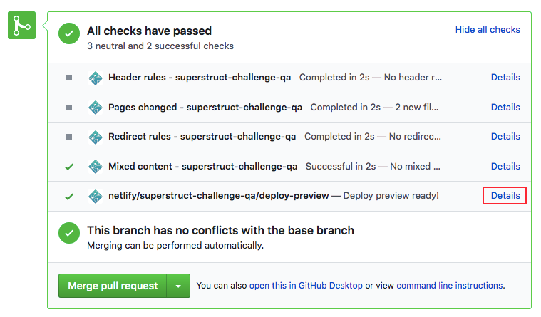

---

# Superstruct Engineering QA Challenge

We need to add lots of features quickly and be sure not to break any existing functionality. We want to make sure that you can review our engineers' work and catch any issues before our users do. Can you review pull requests and communicate with engineers?

## The Challenge

This is a copy of the [todoMVC](http://todomvc.com/) app, a simple todo list which allows users to keep track of their current and completed todos. Review the 2 pull requests in this repo which add a new features the app. Make sure that these features won’t introduce any bugs or degrade the user experience.

## Instructions

How to attempt this challenge:

1) Get yourself familiar with an app. Click the link on top of the page to run the app in your browser
2) Open each deployed preview (deployed pull request). It shows you how app would look like if it was deployed with this new feature. In order to run it:

    a) Click on the 'Pull requests' tab on the top of the page

    b) Click on a pull request you want to review

    c) Click on 'Details' button in a green box with commit statuses, as shown in picture:

3) Create a secret gist with your comments:

    a) Click on '+' in a right top corner of your screen

    b) Click on 'New gist'

    c) Leave your comments and click on 'Create secret gist'
    
4) Copy the URL to your gist and send it to your hiring contact.
